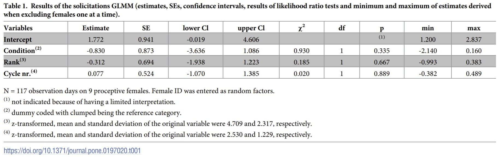
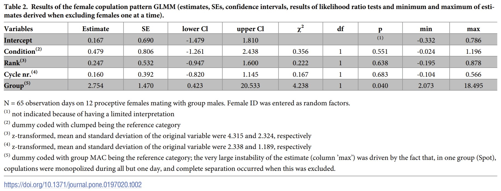
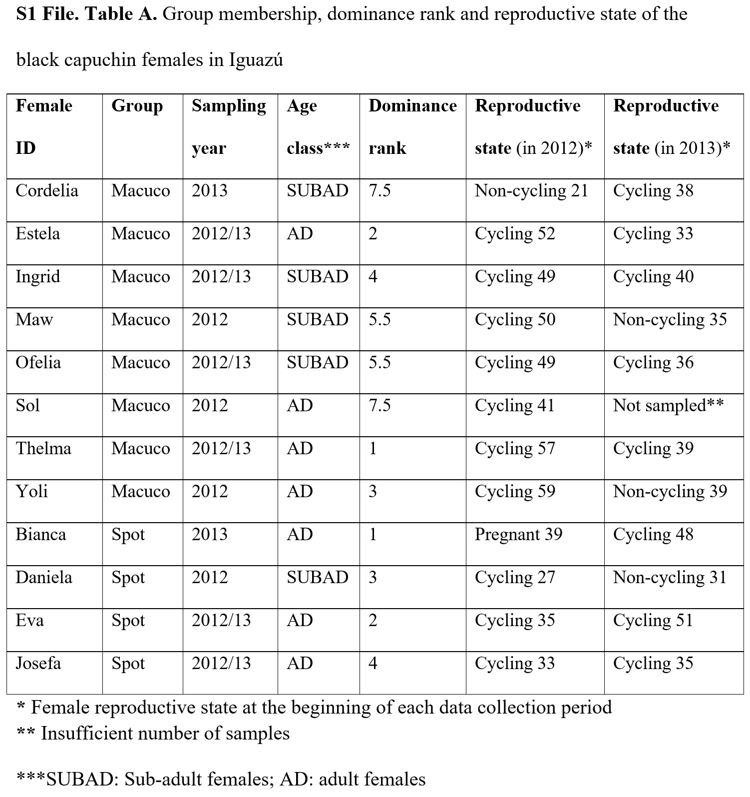
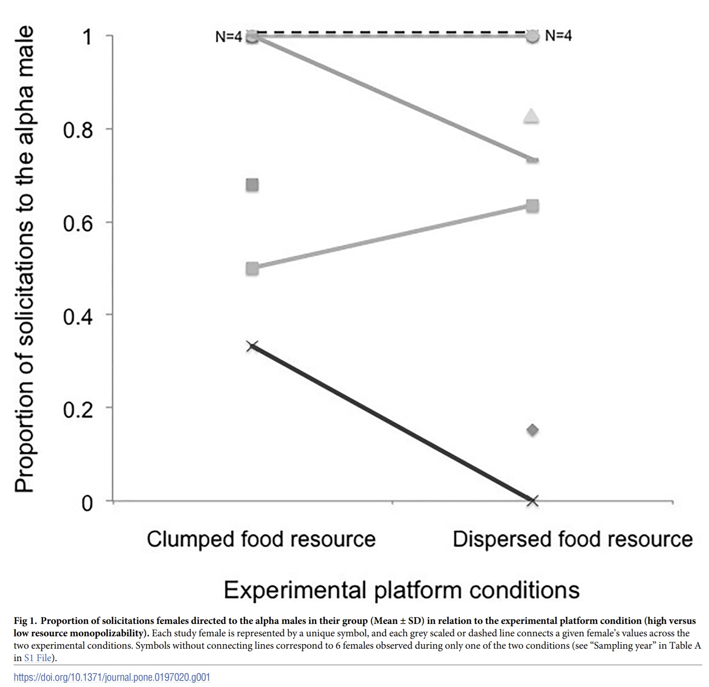
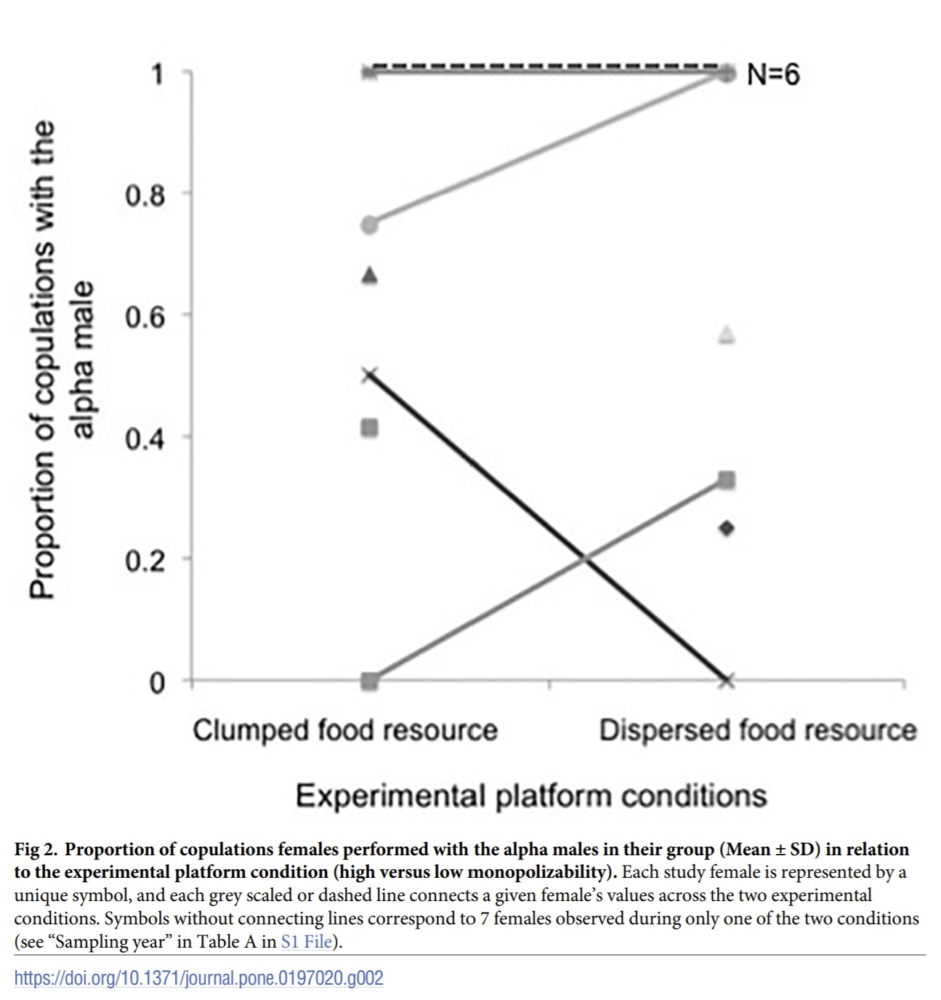

```{r setup, include=FALSE}
knitr::opts_chunk$set(echo = TRUE,
	warning = TRUE,
	message = TRUE,
	comment = "##",
	prompt = FALSE,
	tidy = TRUE,
	tidy.opts = list(blank = FALSE, width.cutoff = 75),
	fig.path = "img/",
	fig.align = "center"
) #tells {knitr} where to output figures/where to find images
```

**Introduction**

Sapajus spp. have been characterized as having a resource-based mating system in which within-group resource monopolization by high-ranking males drives female mating preferences for those males. Tiddi et al. experimentally tested the "resource defense hypothesis" in two groups of black capuchin monkeys, Sapajus nigritus, in Igazu National Park, Argentina, across two consecutive mating seasons- May to August- in 2012 and 2013. During the first season (2012), the authors analyzed female preference for the alpha male under a clumped food condition (in which alpha males could exclude other individuals from the food patch) in the Spot group while testing female preference under a dispersed food condition (in which alpha males could not effectively monopolize food resources) in the Macuco group. The clumped vs. dispersed conditions were then switched for the two groups during the following season (2013).* Specifically, the proportions of solicitations directed to and copulations with the alpha male by each female between the two seasons were compared, with the prediction that if resource defense is a male mating strategy, both variables will be higher under the clumped food condition.

*In their article, the authors write that they presented the Macuco group with the clumped condition and the Spot group with the dispersed condition in 2012, then vice versa in 2013, but their data demonstates the opposite.

**Visualization of Data/Descriptive Analyses**

Tiddi et al. recorded daily measures of sexual solicitations directed to and copulations with the alpha male for each female, along with the female ID, date, year, group, and condition (clumped or dispersed). For each observation day in which females showed proceptivity (N=117), the authors calculated the proportion of female solicitations to the alpha male by calculating the total number of points the female was observed soliciting the alpha male and divided it by the total number of points that female solicited any male. Since all of the solicitations or none of them were directed to the alpha male in nearly all cases, the authors dichotomized this variable such that 1 indicates the majority of solicitations by the female was directed to the alpha and 0 indicates the majority of solicitations was directed to other males. The authors excluded the Spot group from their analyses on solicitations because all solicitations were invariably directed to the alpha male. Similarly, the authors dichotomized the variable for copulations, with 1 indicating that a female copulated exclusively with the alpha male and 0 indicating that the female copulated with any other male (regardless of whether she also copulated with the alpha), for a total of N=65 days on which copulations were observed. In the case of copulations, data from both groups was included.

Finally, the authors also collected information on female reproductive state (number of cycles until conception) and female rank (in a linear dominance hierarchy) and included these variables in their data. The two data tables the authors created and made available via the Figshare repository- one for solicitations and one for copulations- were read in using the code below. Additionally, it was realized upon completing initial statistical analyses that the number of female subjects in the data files did not match that used by the author, so here I also examine the number of unique subjects. I needed to replace subject IDs that included spaces in the datasets with those IDs not including spaces, so that certain subjects were not counted twice (i.e., once with a space in their name and once without). This yielded a total of eight unique subjects in the Macuco group for the solicitations data, and 12 unique subjects across the two groups for the copulations data. Then I filtered the datasets to remove any blanks ("NA"s) under the variables for solicitations ("Prop.SOLIC.to.ALPHA") and copulations ("MONO.PROMIS..COP."), because all subsequent analyses used only those dates for which solicitations or copulations were recorded. This should result in the same datasets the authors used for their statistical analyses, and in fact, it can be seen that the number of observations for both the solicitations and copulations datasets matches those stated by the authors in Tables 1 and 2 (N=117 for solicitations, N=65 for copulations; shown in the Replications/Reanalysis section below).

```{r}
easypackages::libraries("tidyverse", "lme4", "car", "fastDummies")
df_solicitations <- "capuchin_solicitations.csv"
solicitations_og <- read.csv(df_solicitations, header = TRUE, stringsAsFactors = FALSE)
head(solicitations_og)
unique(solicitations_og$SUBJECT)
#replace subject names containing spaces, so they are not counted separately
solicitations_og["SUBJECT"][solicitations_og["SUBJECT"] == "MAW "] <- "MAW"
unique(solicitations_og$SUBJECT)
solicitations <- filter(solicitations_og, Prop.SOLIC.to.ALPHA != "NA")
(nrow(solicitations)) #the number of rows = the number of observations used in analyses

df_copulations <- "capuchin_copulations.csv"
copulations_og <- read.csv(df_copulations, header = TRUE, stringsAsFactors = FALSE)
head(copulations_og)
unique(copulations_og$SUBJECT)
#replace subject names containing spaces, so they are not counted separately
copulations_og["SUBJECT"][copulations_og["SUBJECT"] == "MAW "] <- "MAW"
copulations_og["SUBJECT"][copulations_og["SUBJECT"] == "JOS "] <- "JOS"
unique(copulations_og$SUBJECT)
copulations <- filter(copulations_og, MONO.PROMIS..COP. != "NA")
(nrow(copulations)) #the number of rows = the number of observations used in analyses
```

**Replications/Reanalysis: Inferential Statistical Analyses**

In order to test whether female mating preference was correlated with the degree of resource control shown by the alpha male, Tiddi et al. fitted two Generalized Linear Mixed Models (GLMMs). In their first model, the categorical response was whether the majority of the solicitations on a given day were directed to the alpha male or not (1 or 0). They included experimental condition (clumped vs. dispersed), female rank, and cycle number as fixed effect predictors, and female identity as a random effect. The authors stated they included random slopes of cycle number and experimental condition within female, but did not include the correlation among the random slopes and the intercept because it "appeared unidentifiable as indicated by an absolute value close to one." In their second model, the categorical response was female copulation pattern with the alpha male (1 or 0) during a given day. This model was almost identical to the solicitations model, except there was also a fixed effect of group (because data from both groups was included), but they could not include a random slope of condition. The authors fitted both models in R using the function glmer of the {lme4} package. They also mention that they z-transformed rank and number of cycles to a mean of zero and a standard deviation of one prior to fitting the models. 

Here I attempted to replicate the authors' GLMMs. First, I used the scale() function to center the variables of rank and cycle in both the solicitations and copulations datasets around zero with a standard deviation of one. This, at least, was successfully replicated because using the attributes function, I could see that the means and standard deviations I found for these variables matched those used by the authors as found in Tables 1 and 2. Next, I dummy coded the variables of condition and the proportion of solicitations to the alpha in the solicitations dataset and the variables of condition, group, and whether the copulations were monogamous in the copulations dataset as the authors did (again according to Tables 1 and 2). Then I ran the two GLMMs following the parameters laid out by the authors (as discussed above), using the same glmer function of the {lme4} package that they did. 

The results of the models as compared with those found by the authors can be seen below. 
```{r}
#center variables to a mean of zero and sd of one
solicitations$FEM.RANK <- scale(solicitations$FEM.RANK)
solicitations$CYCLE.. <- scale(solicitations$CYCLE..)
attributes(solicitations$FEM.RANK)
attributes(solicitations$CYCLE..)
#dummy code variables
solicitations <- dummy_cols(solicitations, select_columns = c("PLATF.CONDITION", "Prop.SOLIC.to.ALPHA"))
#replicate the solicitations GLMM
glmer_solicitations <- glmer(Prop.SOLIC.to.ALPHA ~ PLATF.CONDITION + FEM.RANK + CYCLE.. +
  (0 + PLATF.CONDITION | SUBJECT) + (0 + CYCLE.. | SUBJECT), data = solicitations, family = "binomial")
summary(glmer_solicitations)
```
```{r echo=FALSE, out.width="70%"}

```
```{r}
#center variables to a mean of zero and sd of one
copulations$FEM.RANK <- scale(copulations$FEM.RANK)
copulations$CYCLE.. <- scale(copulations$CYCLE..)
attributes(copulations$FEM.RANK)
attributes(copulations$CYCLE..)
#dummy code variables
copulations <- dummy_cols(copulations, select_columns = c("PLATF.CONDITION", "GROUP", "MONO.PROMIS..COP."))
#replicate the copulations GLMM
glmer_copulations <- glmer(MONO.PROMIS..COP. ~ PLATF.CONDITION + FEM.RANK + CYCLE.. + GROUP +
  (0 + CYCLE.. | SUBJECT), data = copulations, family = "binomial")
summary(glmer_copulations)
```
```{r echo=FALSE, out.width="70%"}

```

**Replications/Reanalysis: Visualizations/Figures**

The authors' paper includes two figures (Figures 1 and 2 shown below) which I was able to attempt to replicate based on the data provided. Figure 1 shows the proportion of solicitations females directed to the alpha male in their group in relation to the experimental condition (clumped or dispersed), while Figure 2 shows the proportion of copulations females performed with the alpha male in relation to the experimental condition. Unlike for the GLMMs, the authors did not include the steps they used to create these figures in their methods. However, using the same datafiles, one for each solicitations and copulations found on Figshare and read in above, along with some guidance from the authors' Supplemental 1 File (shown below), I was able to approximately replicate what I believe they did.

For the solicitations figure, I created a tibble to summarize the proportion of solicitations directed to the alpha male by each female under each condition. So, I first filtered the solicitations dataset to include only data for those days on which solicitations were observed. Then I selected those variables necessary to complete the figure- namely the subject, condition, and proportion of solicitations to the alpha male. Then I filtered the condition to include only clumped, grouped the observations by female and took the mean of the values for the proportion of solicitations (a list of 1s and/or 0s), to give one overall average for each female. I repeated this for the dispersed condition (except of course filtered the condition for dispersed rather than clumped). 

As mentioned previously, the solicitations dataset only included data for the Macuco group because all of the solicitations in the Spot group were directed toward the alpha male. While data from the Spot group was not included in the solicitations GLMM, it was included in Figure 1. This difference was initially confusing, but the S1 File was used for clarification. From this file, it can be seen that the eight Macuco group females were included, but only seven of these females were sampled in 2012 (the dispersed condition for that group), while only five were sampled in 2013 (the clumped condition). Therefore, based on the numbers of individuals shown in Figure 1 (i.e., eight in the clumped condition and ten in the dispersed condition), I knew the authors also included those females from the Spot group. According to the S1 File, three Spot group females were sampled in 2012 under the clumped condition, while three were sampled in 2013 under the dispersed condition. Therefore I needed to manually add in these three females to the tibbles created for each condition for the Macuco group females. Therefore, I created tibbles for the Spot group females only for both the clumped and dispersed conditions, using their subject IDs and 1 as the value for the average proportion of solicitations directed to the alpha male in all cases (because all solicitations were invariably directed to the alpha male in the Spot group). I then used rbind() to join these tibbles with those created for the clumped and dispersed conditions for the Macuco group. Then I joined the new tibbles for the clumped and dispersed conditions including all females, to create one tibble, called "solicitations_new" (seen below) which included the subject, the average solicitations directed toward the alpha male ("avg_solic"), and the condition ("Clumped food resource" or "Dispersed food resource"). Finally, I used ggplot to plot the proportion of solicitations directed toward the alpha for each female under both conditions, using condition as the x variable and avg_solic as the y variable. As seen in the authors' plot, I added line segments between the points for females that were present under both conditions.

I repeated the majority of this process to create the figure for the copulations data, except it was unnecessary to create separate tibbles for the Spot group females, because the copulations data file included data for all females from both groups.

```{r echo=FALSE, out.width="70%"}

```
```{r}
#data for Fig. 1
#create tibbles that summarize the average proportion of solicitations directed to the alpha male for each female under the two conditions. I could not figure out how to summarize the proportion of the variables (solicitations here and copulations below) by both female and condition without separating the conditions into different tibbles, so I filtered by condition, then added them back into one tibble at the end.
solicitations_CLUMPED <- filter(solicitations_og, Prop.SOLIC.to.ALPHA != "NA") %>% select(SUBJECT, PLATF.CONDITION, Prop.SOLIC.to.ALPHA) %>% filter(PLATF.CONDITION == "CLUMPED") %>% group_by(SUBJECT) %>% summarise_at(vars(Prop.SOLIC.to.ALPHA), list(avg_solic = mean)) #tibble for Macuco females under clumped condition

solicitations_DISPERSED <- filter(solicitations_og, Prop.SOLIC.to.ALPHA != "NA") %>% select(SUBJECT, PLATF.CONDITION, Prop.SOLIC.to.ALPHA) %>% filter(PLATF.CONDITION == "DISPERSED") %>% group_by(SUBJECT) %>% summarise_at(vars(Prop.SOLIC.to.ALPHA), list(avg_solic = mean)) #tibble for Macuco females under dispersed condition

SUBJECT <- c("BIA", "EVA", "JOS")
avg_solic <- c(1, 1, 1)
CLUMPED_SPOT <- tibble(SUBJECT, avg_solic) #tibble for Spot females under clumped condition
solicitations_CLUMPED_new <- rbind(solicitations_CLUMPED, CLUMPED_SPOT) #combine the Macuco and Spot tibbles for the clumped condition
condition <- c(1:8)
condition[1:8] <- "Clumped food resource" #add in a column for the condition name
solicitations_CLUMPED_new <- tibble(solicitations_CLUMPED_new, condition) #final tibble for all females under clumped condition

SUBJECT <- c("DAN", "EVA", "JOS")
avg_solic <- c(1, 1, 1)
DISPERSED_SPOT <- tibble(SUBJECT, avg_solic) #tibble for Spot females under dispersed condition
solicitations_DISPERSED_new <- rbind(solicitations_DISPERSED, DISPERSED_SPOT) #combine the Macuco and Spot tibbles for the dispersed condition
condition <- c(1:10)
condition <- "Dispersed food resource" #add in a column for the condition name
solicitations_DISPERSED_new <- tibble(solicitations_DISPERSED_new, condition) #final tibble for all females under dispersed condition

#combine the clumped and dispersed condition tibbles into one tibble to use for the plot
(solicitations_new <- rbind(solicitations_CLUMPED_new, solicitations_DISPERSED_new))

#plot condition on the x axis and the mean proportion of solicitations directed to the alpha male for each female on the y axis
ggplot(data = solicitations_new, aes(x = condition, y = avg_solic)) +
  geom_point() + xlab("Experimental platform conditions") + scale_y_continuous(name = "Proportion of solicitations to the alpha male", breaks = c(0, 0.2,0.4,0.6, 0.8, 1), labels = c("0", "0.2","0.4","0.6", "0.8", "1")) +
  
#add in line segments connecting the two conditions for each female; the points for the three females of the "SPOT GROUP" are actually at y=1, but I moved the segment down slightly to make it easier to see 
  geom_segment(aes(x = "Clumped food resource", y = .995, xend = "Dispersed food resource", yend = .995, colour = "SPOT GROUP, N=3"), data = solicitations_new) +
  geom_segment(aes(x = "Clumped food resource", y = avg_solic[2], xend = "Dispersed food resource", yend = avg_solic[9], colour = "EST"), data = solicitations_new) +
  geom_segment(aes(x = "Clumped food resource", y = avg_solic[3], xend = "Dispersed food resource", yend = avg_solic[10], colour = "ING"), data = solicitations_new, linetype = "dashed") +
  geom_segment(aes(x = "Clumped food resource", y = avg_solic[4], xend = "Dispersed food resource", yend = avg_solic[12], colour = "OFE"), data = solicitations_new) +
  geom_segment(aes(x = "Clumped food resource", y = avg_solic[5], xend = "Dispersed food resource", yend = avg_solic[14], colour = "TH"), data = solicitations_new) +

#add in text for N=5, because there are 5 total females that overlap at y=1 in both conditions (the authors' figure shows N=4, because there are 3 females represented by the solid line, one by the dotted line, and one by an additional point for which that female is only at y=1 in one condition or the other (OFE in the clumped condition and MAW, who was only sampled in 2012, in the dispersed condition), but I think providing the total at each point is less confusing)
  geom_text(data = solicitations_new, aes(x = "Clumped food resource", y = 1.05, label = "N=5")) + 
  geom_text(data = solicitations_new, aes(x = "Dispersed food resource", y = 1.05, label = "N=5"))
```
```{r echo=FALSE, out.width="70%"}

```
```{r}
#data for Fig 2.
#create tibbles that summarize the average proportion of copulations with the alpha male for each female under the two conditions
copulations_CLUMPED <- filter(copulations_og, MONO.PROMIS..COP. != "NA") %>% select(SUBJECT, PLATF.CONDITION, MONO.PROMIS..COP.) %>% filter(PLATF.CONDITION == "CLUMPED") %>% group_by(SUBJECT) %>% summarise_at(vars(MONO.PROMIS..COP.), list(avg_solic = mean)) #tibble for all females under clumped condition

copulations_DISPERSED <- filter(copulations_og, MONO.PROMIS..COP. != "NA") %>% select(SUBJECT, PLATF.CONDITION, MONO.PROMIS..COP.) %>% filter(PLATF.CONDITION == "DISPERSED") %>% group_by(SUBJECT) %>% summarise_at(vars(MONO.PROMIS..COP.), list(avg_solic = mean)) #tibble for all females under dispersed condition

condition <- c(1:7)
condition[1:7] <- "Clumped food resource" #add in a column for the condition name
copulations_CLUMPED_new <- tibble(copulations_CLUMPED, condition) #final tibble for all females under clumped condition

condition <- c(1:10)
condition <- "Dispersed food resource" #add in a column for the condition name
copulations_DISPERSED_new <- tibble(copulations_DISPERSED, condition) #final tibble for all females under dispersed condition

#combine the clumped and dispersed condition tibbles into one tibble to use for the plot
(copulations_new <- rbind(copulations_CLUMPED_new, copulations_DISPERSED_new))

#plot condition on the x axis and the mean proportion of copulations with the alpha male for each female on the y axis
ggplot(data = copulations_new, aes(x = condition, y = avg_solic)) +
  geom_point() + xlab("Experimental platform conditions") + scale_y_continuous(name = "Proportion of copulations with the alpha male", breaks = c(0, 0.2,0.4,0.6, 0.8, 1), labels = c("0", "0.2","0.4","0.6", "0.8", "1")) +
  
#add in line segments connecting the two conditions for each female; as with above, the points for OFE are actually at y=1, but I moved the segment down slightly to make it easier to see 
  geom_segment(aes(x = "Clumped food resource", y = avg_solic[3], xend = "Dispersed food resource", yend = avg_solic[9], colour = "EST"), data = copulations_new) +
  geom_segment(aes(x = "Clumped food resource", y = avg_solic[4], xend = "Dispersed food resource", yend = avg_solic[10], colour = "EVA"), data = copulations_new, linetype = "dashed") +
  geom_segment(aes(x = "Clumped food resource", y = avg_solic[5], xend = "Dispersed food resource", yend = avg_solic[11], colour = "ING"), data = copulations_new) +
  geom_segment(aes(x = "Clumped food resource", y = .995, xend = "Dispersed food resource", yend = .995, colour = "OFE"), data = copulations_new) +
  geom_segment(aes(x = "Clumped food resource", y = avg_solic[7], xend = "Dispersed food resource", yend = avg_solic[16], colour = "TH"), data = copulations_new) +
geom_text(data = copulations_new, aes(x = "Clumped food resource", y = 1.05, label = "N=2")) +
geom_text(data = copulations_new, aes(x = "Dispersed food resource", y = 1.05, label = "N=6"))
```
```{r echo=FALSE, out.width="70%"}

```

**Discussion**

From the results of the replicated analyses, I would have reached the same overall conclusion as Tiddi et al.; there is not support for the "resource defense hypothesis," because female preferences for alpha males did not significantly vary according to the two experimental conditions. Within-group male resource defense may not be a mating strategy in Sapajus nigritus, as females still preferred alpha males, as evidenced by the proportion of solicitations directed to and copulations with those males, even when their ability to control food was substantially decreased. Despite reaching the same conclusion, little of the findings of Tiddi et al. could be *precisely* replicated.

Neither of the GLMMs produced the exact coefficients, standard errors, or p-values as that of the authors for any of the variables. The values really do not even seem close in most cases (e.g., the coefficient I found for female rank in the solicitations model was 0.2337, while the authors' was -0.312). This is somewhat surprising, considering the authors were pretty explicit about how they set up their models and how they transformed/coded each variable. Plus, the number of observations for each model was the same as that used by the authors, and the means and standard deviations of the Z-transformed variables were identical. One strange discrepancy is seen between my and the authors' solicitations GLMMs, because the authors state under Table 1 that their data includes nine proceptive females, while mine only included eight. It seems highly likely that this is a mistake on the part of the authors, because the dataset for solicitations originally included nine unique subjects, until I replaced the subject names containing spaces, so they would not be counted separately. However, this is still insufficient to account for the differences between the results of the models. Both my and the authors' copulations GLMMs produced different results despite containing the same number of subjects, and when I ran the solicitations GLMM with nine subjects (before replacing the name that contained spaces), I still had different results. Therefore, it is unclear whether these discrepancies are ultimately due to differences in the way I set up my GLMMs compared to the authors' or other errors in the posted datasets. 

I was somewhat more successfully able to replicate the figures in the original article. In fact, the figure for the proportion of copulations with the alpha male (Figure 2) appears to contain exactly the same data- both for the number of subjects in each condition and the values for each female, although it is not possible to confirm this because the authors do not explicity provide the data they used. The figure for the proportion of solicitations to the alpha male (Figure 1), however, clearly has differences. I checked multiple times to confirm that I had calculated the values for each female correctly and was connecting the correct points with the line segments, so again, I do not know whether these discrepancies are due to differences in the methods or data that were used.

The authors also performed additional analyses that I was not able to replicate, because the data necessary was not provided. For example, the authors explored whether certain female characteristics, such as reproductive state, influence the degree of feeding tolerance by the alpha male. I am curious whether I would have encountered similar issues in replicating additional parts of the study. I am guilty of glossing over methods sections when short on time and making the assumption that authors have performed all of their analyses and calculations correctly; completing this data replication and reanalysis assignment has made me reconsider how much of an article I should take at face value.

**References**

Tiddi, B., Heistermann, M., Fahy, M. K., & Wheeler, B. C. (2018). Male resource defense mating system in primates? An experimental test in wild capuchin monkeys. PloS one, 13(5), e0197020. https://doi.org/10.1371/journal.pone.0197020